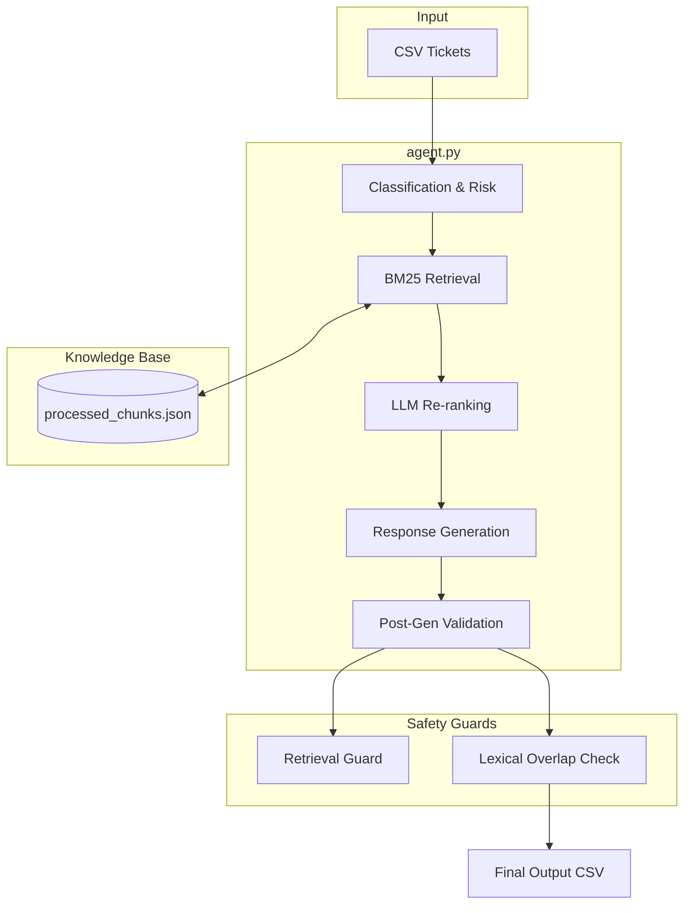

# 🎨 DESIGN.md — System Architecture

This document provides a technical overview of the Support Triage Agent's architecture and module responsibilities.

---

## 🏗️ System Architecture

---

## 🧩 Module Responsibilities

### Core Logic
*   **`main.py`**: The entry point. Handles CSV loading, batch iteration, and final output writing.
*   **`agent.py`**: The orchestrator. Coordinates the flow between classification, retrieval, and generation. Implements the decision matrix for `reply` vs `escalate`.
*   **`client_manager.py`**: Resilience layer. Manages a pool of 6 API keys with round-robin rotation and exponential backoff to handle rate limits.

### Specialized Components
*   **`classifier.py`**: Uses Gemini to determine `product_area`, `request_type`, and `should_escalate` in a single unified call.
*   **`retriever.py`**: Implements BM25 retrieval over the local corpus. Includes a semantic re-ranking step where Gemini picks the best chunks from the top 10 candidates.
*   **`generator.py`**: Produces grounded responses based on the provided context. Enforces strict determinism (`temperature=0`).
*   **`escalation.py`**: A fast-path keyword pre-check for immediate high-risk detection.
*   **`validate.py`**: An audit tool that checks schema compliance and computes accuracy against sample datasets.

---

## 🔄 Data Flow Explanation

1.  **Ingestion**: Tickets are read and normalized (lowercase, stripped).
2.  **Intent & Risk**: The classifier determines if the ticket is a valid support request and if it carries high-risk implications (fraud, account access).
3.  **Context Discovery**: The retriever searches the processed knowledge base. It uses a **Company Boost** to ensure that HackerRank tickets only retrieve HackerRank documentation.
4.  **Triage Decision**: The agent reviews the risk level and the confidence of the retrieved documentation. If no reliable documentation exists for a valid request, it defaults to **Escalation**.
5.  **Grounded Response**: For documented issues, a response is generated using **ONLY** the retrieved chunks.
6.  **Audit**: Every response is validated for lexical overlap with the source chunks before being finalized.
