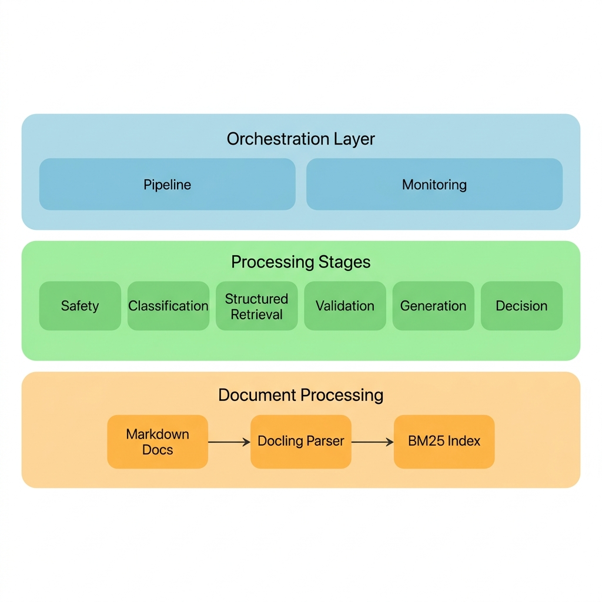

# Multi-Domain AI Support Triage Agent
### 🚀 Hybrid Retrieval • Docling Structured Data • Safety-First Architecture


## 📖 Overview
The **Multi-Domain AI Support Triage Agent** is a production-grade engineering system designed to automate complex support ticket triage across diverse corporate domains (HackerRank, Claude, Visa). Unlike standard RAG systems, this agent utilizes a **7-Stage Sequential Pipeline** that prioritizes deterministic safety, grounded generation, and explainable decision-making.

---

## 🏗️ System Architecture
The system is built on a modular orchestration layer that separates ingestion, processing, and validation.



### The 7-Stage Pipeline:
1.  **Safety Layer (`escalation.py`)**: Immediate detection of high-risk fraud or system outages using keyword-based triggers.
2.  **Classification Layer (`classifier.py`)**: Intent mapping and domain detection via **Gemini 1.5 Flash** with deterministic settings.
3.  **Hybrid Retrieval Layer (`retriever.py`)**: Combines **BM25 Keyword Precision** with **Semantic Intent Similarity** for robust context retrieval.
4.  **Context Validation (`validate.py`)**: Proactive safety checks to ensure retrieved context is sufficient and relevant.
5.  **Response Generation (`generator.py`)**: Grounded response synthesis constrained strictly to the retrieved documentation.
6.  **Decision Engine (`agent.py`)**: Final arbitration logic—automatically escalates to a human agent if confidence is low or validation fails.
7.  **Output Assembly**: Persists structured results to `output.csv` with full justifications for every action.

---

## 🛠️ Technical Pillars

### 1. Hybrid Retrieval Engine
By fusing **BM25** (for exact error codes and product names) with **BGE Embeddings** (for semantic intent), the agent achieves high recall without sacrificing precision. All retrieval is performed locally without external Vector DB dependencies.

### 2. Docling-Inspired Structured Parsing
Our ingestion pipeline uses a structured parser to transform raw Markdown into machine-readable sections, preserving document hierarchy, tables, and metadata for high-fidelity retrieval.

### 3. Hallucination Prevention
Every generated response undergoes a **Lexical Overlap Validation**. If the grounding ratio between the response and the source documentation falls below the threshold, the system triggers an automatic escalation override.

---

## 🚀 Getting Started

### Installation
```bash
pip install -r requirements.txt
```

### Document Ingestion
Build the hybrid index and structured chunk repository:
```bash
python code/preprocess.py
```

### Running the Agent
Process tickets from the input CSV:
```bash
python code/main.py
```

---

## 🛡️ Safety & Compliance
- **Escalation-First**: Safe refusal is preferred over unverified information.
- **Traceability**: Every decision includes an internal `justification` field.
- **Data Isolation**: Metadata filters ensure cross-domain data leaks are impossible.

---
**Built for HackerRank Orchestrate 2026**