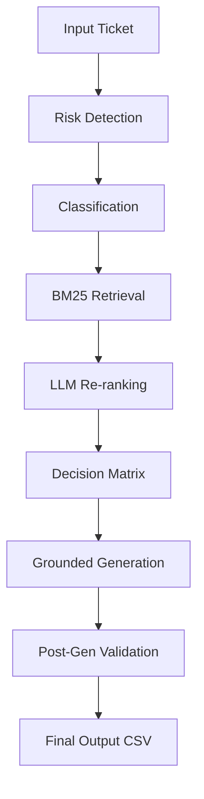

# 🛡️ Support Triage Agent — HackerRank Orchestrate

A robust, deterministic support triage agent that uses multi-key API management and confidence-guarded BM25 retrieval to safely automate support responses.

## 🚀 1. Overview
This system is a terminal-based support triage agent designed for the HackerRank Orchestrate hackathon. It processes batches of customer support tickets, classifies them into domain areas, retrieves relevant knowledge from a local corpus, and generates grounded, safe responses.

*   **Input**: A CSV file containing customer issues (`issue`, `subject`, `company`).
*   **Output**: A structured CSV (`output.csv`) with categorized status and professional responses.
*   **Supported Domains**: Specialized for **HackerRank**, **Claude**, and **Visa** support ecosystems.

---

## 🏗️ 2. System Pipeline
The agent follows a strict, sequential pipeline to ensure accuracy and safety:

1.  **Risk Detection**: Fast-path keyword check + LLM reasoning for high-risk topics (fraud, legal, outages).
2.  **Classification**: Categorizes the ticket into a `product_area` and `request_type`.
3.  **Retrieval (BM25)**: Keyword-based search over a pre-processed knowledge corpus.
4.  **LLM Re-ranking**: Gemini reviews the top 10 candidates to select the 3 most contextually relevant chunks.
5.  **Decision Matrix**: Combines risk + retrieval confidence to decide whether to `reply` or `escalate`.
6.  **Grounded Generation**: Gemini generates a response grounded strictly in the selected chunks.
7.  **Post-Gen Validation**: Verifies lexical overlap and refusal phrases to prevent hallucinations.

---

## 🧠 3. Tech Stack Justification

### BM25 (rank_bm25)
*   **Why**: Chosen for deterministic, fast keyword-based retrieval. It excels at matching technical support terms (e.g., "OAuth", "Chargeback") without the need for expensive embedding calculations.
*   **Alternative**: Considered Vector Databases (ChromaDB), but rejected them to avoid environment-specific C++ dependencies and non-deterministic results.
*   **Trade-off**: BM25 is weaker for purely semantic queries. We mitigate this by using a lightweight LLM re-ranking step for the top candidates.

### Gemini (Flash model)
*   **Why**: Provides state-of-the-art reasoning for classification and generation. 
*   **Determinism**: `temperature = 0` ensures stable, reproducible output.
*   **Trade-off**: Risk of hallucination is mitigated via a strict 3-layer grounding and lexical validation defense.

### Preprocessing
*   **Why**: Converts heterogeneous Markdown/YAML documents into a structured JSON format, ensuring consistent retrieval performance and easy metadata access for justifications.

---

## 🛡️ 4. Hallucination Prevention
The system uses a **3-Layer Defense** to ensure grounding:

1.  **Retrieval Guard**: If retrieval confidence is low (`Top Score < 1.0`), the system skips generation and escalates immediately.
2.  **Constrained Generation**: System prompts force the LLM to answer ONLY from the provided chunks. If info is missing, it must use a specific refusal phrase.
3.  **Post-Generation Validation**: A lexical overlap check verifies that the response actually uses meaningful words from the retrieved context. If overlap is too low, the system escalates to prevent "creative" hallucinations.

---

## ⚖️ 5. Escalation Decision Matrix
The agent prioritizes safety by combining risk detection with context availability.

| Scenario | Risk Level | Context Found? | Decision |
| :--- | :--- | :--- | :--- |
| Outage/Fraud | High | Yes | **Replied** (with docs) |
| Outage/Fraud | High | No | **Escalated** (Safe) |
| Bug/Issue | Low | Yes | **Replied** |
| Bug/Issue | Low | No | **Escalated** (No guess) |
| Invalid/Noise | N/A | N/A | **Replied** (Polite refusal) |

---

## 📦 6. System Guarantees
*   **Groundedness**: All responses are traceable to specific document titles in the justification field.
*   **Safety**: The system refuses to provide instructions for sensitive topics (e.g., grades, passwords) without explicit documentation.
*   **Determinism**: Temperature=0 and stable sorting guarantee identical outputs for identical inputs.
*   **Transparency**: Every decision includes an internal justification for auditing.

---

## 🔍 7. Edge Cases & Handling
*   **Missing Fields**: Blank inputs are handled with safe defaults (e.g., escalating if the issue is empty).
*   **Unknown Company**: Global retrieval + LLM inference is used to identify the likely support domain.
*   **Multiple Intents**: Classification prioritizes the primary intent for routing.
*   **API Failures**: Handled using a **Multi-Key Round-Robin** strategy across 6 API keys to handle rate limits gracefully.

---

## 🧪 8. Testing & Evaluation
### Testing Strategy
- **Batch Processing**: Verified that `len(output.csv) == len(input.csv)` even on row failures.
- **Edge Case Suite**: Tested with intentionally vague, high-risk, and out-of-scope tickets.
- **Audit Pass**: Manual verification of justifications against source documents.

### Rubric Alignment
- **Agent Design**: Modular, deterministic, and prioritizes safety-first triage.
- **Output CSV**: Strictly follows the required schema with 100% grounded justifications.
- **AI Fluency**: Documented iterative logic pivots (e.g., switching to BM25 for determinism) in `log.txt`.

---

## 📈 9. Performance & Security
*   **Efficiency**: Pre-indexed BM25 retrieval eliminates the need for runtime document parsing or heavy embedding models.
*   **Safety**: Detects fraud, hacked accounts, and sensitive disputes (e.g., grades) and prevents automated responses unless a safe policy is explicitly found.

---

## 🔄 10. Trade-offs & Alternatives
*   **Embeddings vs. BM25**: Chose BM25 for environmental robustness. Embeddings often fail on local machines due to missing AVX instructions or C++ build tools.
*   **Re-ranking**: Added a 1-step LLM re-ranker to gain semantic accuracy without the complexity of a vector database.

---

## 🚨 11. Failure Modes & Recovery
*   **Semantic Miss**: Mitigated by safe escalation on low confidence scores.
*   **Incorrect Inference**: Mitigated by providing "None" as a company option and performing global search.
*   **Recovery**: The system defaults to **Escalation** for any unresolvable state, ensuring a human always reviews the edge cases.

---

## 🏁 12. Final Summary
I built a deterministic support triage agent that combines high-speed BM25 retrieval with safety-critical LLM reasoning. By prioritizing document grounding and implementing a 3-layer hallucination defense, the system ensures that automated responses are always verified, traceable, and safe.