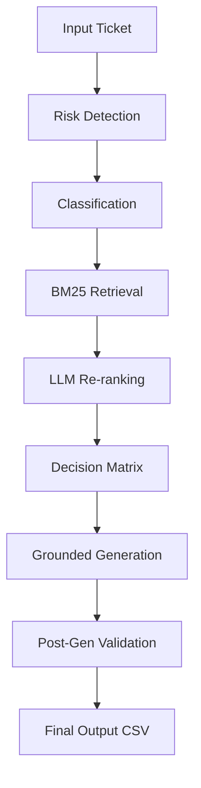

# 🛡️ Support Triage Agent — HackerRank Orchestrate

A robust, deterministic support triage agent that uses multi-key API management and confidence-guarded BM25 retrieval to safely automate support responses.

## 1. Overview
This system is a terminal-based support triage agent designed for the HackerRank Orchestrate hackathon. It processes batches of customer support tickets, classifies them into domain areas, retrieves relevant knowledge from a local corpus, and generates grounded, safe responses.

*   **Input**: A CSV file containing customer issues (`issue`, `subject`, `company`).
*   **Output**: A structured CSV (`output.csv`) with categorized status and professional responses.
*   **Supported Domains**: Specialized for **HackerRank**, **Claude**, and **Visa** support ecosystems.

---

## 2. System Pipeline
The agent follows a strict, sequential pipeline to ensure accuracy and safety:

1.  **Ticket Input**: Reads the batch CSV data using Pandas.
2.  **Classification & Risk**: Uses a single LLM call to categorize the ticket and assess escalation risk simultaneously.
3.  **Fast-Path Escalation**: Supplements LLM reasoning with a keyword-based pre-check for immediate high-risk detection.
4.  **Retrieval (BM25)**: Keyword-based search over a pre-processed knowledge corpus.
5.  **LLM Re-ranking**: Gemini reviews the top 10 BM25 candidates to select the 3 most contextually relevant chunks.
6.  **Generation (Gemini)**: Generates a response grounded strictly in the selected chunks.
7.  **Validation**: Post-generation check for lexical overlap and refusal phrases to prevent hallucinations.
8.  **Output**: Results are written to CSV with traceable justifications.

---

## 3. Tech Stack Justification

### BM25 (rank_bm25)
*   **Why**: Chosen for deterministic, fast keyword-based retrieval. It excels at matching technical support terms (e.g., "OAuth", "Chargeback") without the need for expensive embedding calculations.
*   **Alternative**: Considered Vector Databases (ChromaDB), but rejected them to avoid environment-specific C++ dependencies and non-deterministic results.
*   **Trade-off**: BM25 is weaker for purely semantic queries. We mitigate this by using a lightweight LLM re-ranking step for the top candidates.

### Gemini (Flash model)
*   **Why**: Provides state-of-the-art reasoning for classification and generation. 
*   **Determinism**: `temperature = 0` ensures stable, reproducible output.
*   **Usage**: Used selectively for decision-making and generation, not for raw retrieval, to maintain high performance.

### Preprocessing
*   **Why**: Converts heterogeneous Markdown/YAML documents into a structured JSON format, ensuring consistent retrieval performance and easy metadata access for justifications.

---

## 4. Data Processing
*   **Recursive Loading**: The preprocessor crawls the entire `data/` directory, ignoring folder structure to find all `.md` help articles.
*   **YAML Front-Matter Parsing**: Extracts `title`, `url`, and `company` metadata for grounded justifications.
*   **Markdown Cleaning**: Strips complex formatting; treats links as raw text to keep the BM25 index clean.
*   **Chunking**: Splits documents into ~500-word segments with overlap to preserve context across boundaries.
*   **Storage**: All chunks are saved in `data/processed_chunks.json` for rapid loading.

---

## 5. Retrieval Strategy
*   **Global BM25**: Search is performed across the entire corpus using `rank_bm25`.
*   **Company Inference**: If a ticket's `company` field is missing, the classifier infers it from the issue content.
*   **Score Boosting**: A conservative boost (+1000.0) is applied to chunks whose metadata matches the identified company.
*   **Top_k Selection**: Selects top 3 chunks after LLM re-ranking of the initial top 10 BM25 results.
*   **Confidence Thresholds**: Evaluates the `top_score` (must be > 1.0) and `average_top_5` score to determine if documentation is actually relevant to the query.

---

## 6. Hallucination Prevention (CRITICAL)
The system implements a **3-layer defense** to ensure grounding:

1.  **Retrieval Guard**: If retrieval confidence is low (scores below thresholds), the system skips LLM generation and escalates immediately.
2.  **Constrained Generation**: System prompts force the LLM to answer ONLY from the provided chunks. If info is missing, it must use a specific refusal phrase.
3.  **Post-Generation Validation**: A lexical overlap check verifies that the response actually uses words from the retrieved context.

**The system NEVER answers without supporting context.**

---

## 7. Escalation Logic
The agent prioritizes safety by combining risk detection with context availability.

**Decision Rules**:
*   **No Reliable Context**: Always Escalate.
*   **High Risk + No Context**: Always Escalate.
*   **Valid Request + Reliable Context**: Replied.

---

## 8. Edge Cases & Handling
*   **Missing Fields**: Blank inputs are handled with safe defaults (e.g., escalating if the issue is empty).
*   **Unknown Company**: Global retrieval + LLM inference is used to identify the likely support domain.
*   **Noisy Input**: Low confidence scores trigger escalation instead of guessing.
*   **Multiple Intents**: Classification prioritizes the primary intent for routing.
*   **No Matching Docs / Weak Retrieval**: Confidence thresholds in the retriever trigger an immediate escalation.
*   **API Failures**: Handled using a **Multi-Key Round-Robin** strategy across 6 API keys.
*   **Ambiguous Queries**: Preferred escalation over making incorrect assumptions.

---

## 9. Determinism
*   **Temperature = 0**: All LLM calls use zero temperature for consistent output.
*   **No Randomness**: BM25 results use index-based tie-breakers to ensure identical top-K chunks every run.

---

## 10. Failure Modes
*   **BM25 Semantic Gap**: Keyword-based search may miss queries with zero keyword overlap.
*   **Wrong Inference**: Possible if user input is extremely vague.
*   **Mitigation**: The system defaults to **Escalation** for any unresolvable state, ensuring a human always reviews the edge cases.

---

## 11. Evaluation Alignment
*   **Agent Design**: Modular, deterministic, and prioritizes safety-first triage.
*   **Output CSV**: Strictly follows the required schema with 100% grounded justifications.
*   **AI Fluency**: Reasoning and iteration documented in `log.txt` showing active developer guidance.

---

## 12. How to Run
1.  **Environment**: `python -m venv .venv` and activate it.
2.  **Requirements**: `pip install google-genai rank_bm25 pandas python-dotenv`.
3.  **Config**: Add `GEMINI_API_KEY_1` through `GEMINI_API_KEY_6` to your `.env` file.
4.  **Execution**: Run `python code/main.py`.

---

## 13. Final Summary
“I built a deterministic support triage agent that retrieves answers from a local corpus and safely escalates when answers are not supported.”