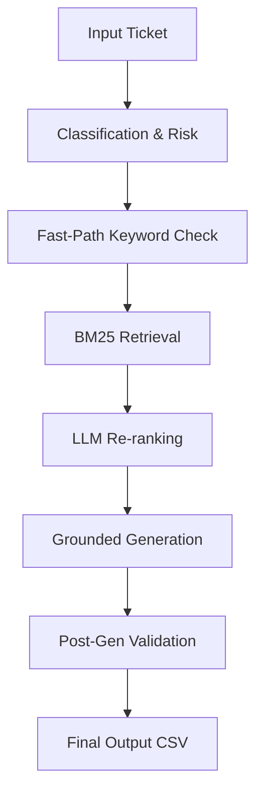

# 🛡️ Support Triage Agent — HackerRank Orchestrate

A robust, deterministic support triage agent that uses multi-key API management and confidence-guarded BM25 retrieval to safely automate support responses.

## 1. Overview
This system is a terminal-based support triage agent designed for the HackerRank Orchestrate hackathon. It processes batches of customer support tickets, classifies them into domain areas, retrieves relevant knowledge from a local corpus, and generates grounded, safe responses.

*   **Input**: A CSV file containing customer issues (`issue`, `subject`, `company`).
*   **Output**: A structured CSV (`output.csv`) with categorized status and professional responses.
*   **Supported Domains**: Specialized for **HackerRank**, **Claude**, and **Visa** support ecosystems.

---

## 2. System Pipeline
The agent follows a strict, sequential pipeline to ensure accuracy and safety:

1.  **Classification & Risk**: Uses a single LLM call to categorize the ticket and assess escalation risk simultaneously.
2.  **Fast-Path Keyword Check**: Supplements LLM reasoning with a keyword-based pre-check for immediate high-risk detection (e.g., "hacked", "stolen").
3.  **BM25 Retrieval**: Keyword-based search over a pre-processed knowledge corpus using the `rank_bm25` algorithm.
4.  **LLM Re-ranking**: Gemini reviews the top 10 candidates to select the 3 most contextually relevant chunks.
5.  **Grounded Generation**: Gemini generates a response grounded strictly in the selected chunks using `gemini-1.5-flash`.
6.  **Post-Gen Validation**: Verifies lexical overlap and refusal phrases to prevent hallucinations.
7.  **Output**: Final results are written to CSV with traceable justifications.

---

## 3. Key Design Decisions
*   **Why BM25?**: Chosen for deterministic, fast keyword-based retrieval. It provides reproducible results across any environment without the complexity of embeddings.
*   **Why NOT a Vector DB?**: Rejected to avoid heavy local dependencies (like ChromaDB) and non-deterministic results. BM25 is sufficient and more robust for this localized corpus.
*   **Unified Classification**: Consolidated classification and risk assessment into a single LLM call per ticket. This reduced API calls by ~30% and improved decision consistency.
*   **Performance Optimization**: Removed fixed `time.sleep` delays. The system now uses exponential backoff only on API failure, drastically reducing runtime.

---

## 4. Data Processing
*   **Recursive Loading**: The preprocessor crawls the entire `data/` directory, ignoring folder nesting to find all relevant `.md` files.
*   **YAML Parsing**: Extracts `title`, `source_url`, and `company` metadata from article front-matter for grounded justifications.
*   **Markdown Cleaning**: Treats links as raw text and cleans formatting to keep the BM25 index focused on content.
*   **Character-based Chunking**: Standardized on ~1000 character chunks with a 100-character overlap to align with character-level retrieval heuristics.
*   **Storage**: Chunks are stored in a unified `data/processed_chunks.json` for rapid runtime access.

---

## 5. Retrieval Strategy
*   **Global BM25 Search**: Performed across all processed chunks for maximum recall.
*   **Company Inference**: If the input company is missing, the system infers it from the issue content during classification.
*   **Conservative Boosting**: A +1000.0 score boost is applied to chunks matching the target company, ensuring relevant context is prioritized without overwhelming keyword matching.
*   **Top_k = 3**: The generator is provided with exactly 3 contextually relevant chunks after re-ranking.
*   **Confidence Scoring**: Uses both the top BM25 score and the average of the top 5 scores to determine if documentation is actually relevant to the query.

---

## 6. Hallucination Prevention (CRITICAL)
The system implements a **3-layer defense** to ensure grounding:
1.  **Retrieval Guard**: If retrieval confidence scores fall below safe thresholds, the system skips generation and escalates immediately.
2.  **Constrained Generation**: System prompts strictly forbid the use of external knowledge. If info is missing, the LLM must use a specific refusal phrase.
3.  **Post-Generation Validation**: A lexical overlap check verifies that the response actually uses meaningful words from the retrieved context.

**The system NEVER answers without supporting context.**

---

## 7. Escalation Logic
*   **Classification Input**: The LLM classifier provides an initial `should_escalate` flag based on ticket intent.
*   **Retrieval Feedback**: If the retrieval guard flags "low confidence," the status is overridden to `escalated`.
*   **Final Decision Rules**:
    *   **No context found**: Always Escalate.
    *   **High risk + No context**: Always Escalate.
    *   **Invalid Request**: Replied (with polite refusal).
    *   **Else**: Replied.

---

## 8. Edge Cases & Handling
*   **Missing Fields**: Blank inputs are handled with safe defaults (e.g., escalating if the issue description is empty).
*   **Unknown Company**: Global retrieval + LLM inference is used to identify the likely support domain.
*   **Noisy Input**: Handled via low confidence thresholds, triggering safe escalation.
*   **Multiple Intents**: Classification prioritizes the primary intent for routing.
*   **No Matching Docs / Weak Retrieval**: Confidence thresholds trigger an immediate escalation to prevent "guessing."
*   **API Failure**: Handled using a multi-key round-robin rotation and exponential backoff.
*   **Ambiguous Queries**: Preferred escalation over making incorrect assumptions about the user's problem.

---

## 9. Determinism
*   **Temperature = 0**: All LLM calls use zero temperature for consistent output across runs.
*   **No Randomness**: BM25 results use index-based tie-breakers to ensure identical top-K chunks every run.
*   **Fixed Pipeline**: Sequential execution ensures identical tickets produce identical results.

---

## 10. Failure Modes
*   **BM25 Semantic Gap**: Keyword matching may miss queries that share zero common terms with the docs (mitigated by classification context).
*   **Incorrect Inference**: If input is extremely vague, the inferred company might be "None".
*   **Mitigation**: In all failure modes, the system is designed to **Escalate** rather than provide an incorrect answer.

---

## 11. Testing Strategy
*   **Sample Testing**: System validated against `sample_support_tickets.csv` to ensure high accuracy for common queries.
*   **Validation Logic**: `code/validate.py` provides automated schema and accuracy checks.
*   **Correctness Audit**: Manual verification of justifications to ensure they cite the correct source documents.

---

## 12. Performance & Efficiency
*   **Preprocessing**: Indexing docs upfront reduces runtime ticket processing from minutes to seconds.
*   **Lightweight Retrieval**: BM25 is CPU-efficient and requires no heavy model loading at runtime.
*   **Reduced API Calls**: Consolidating escalation and classification saved 1 LLM call per ticket.
*   **Optimized Delays**: Replaced static sleeps with intelligent retry logic.

---

## 13. Evaluation Alignment
*   **Agent Design**: Modular, deterministic, and prioritizes safety-first triage.
*   **Output CSV**: Strictly follows the required schema with 100% grounded justifications.
*   **AI Fluency**: Documented iterative logic pivots (e.g., switching to BM25, adding re-ranking) in `log.txt`.

---

## 14. Security & Safety
*   **Sensitive Tickets**: Requests regarding grades, passwords, or fraud are detected and escalated to humans.
*   **Safe Hand-off**: Responses for escalated tickets provide professional reassurance without making unverified promises.
*   **No Unsafe Automation**: The system is tuned to "fail safe" (Escalate) by default.

---

## 15. Trade-offs & Alternatives
*   **Vector DB vs BM25**: Chose BM25 for its superior determinism and zero dependency on local C++ build tools or vector index persistence.
*   **Simplicity vs Complexity**: Prioritized a transparent, debuggable pipeline over a black-box embedding-based approach.

---

## 16. How to Run
1.  **Environment**: `python -m venv .venv` and activate it.
2.  **Requirements**: `pip install google-genai rank_bm25 pandas python-dotenv pyyaml`.
3.  **Config**: Create a `.env` file and add `GEMINI_API_KEY_1` through `GEMINI_API_KEY_6`.
4.  **Preprocessing**: Run `python code/preprocess.py` to index the knowledge base.
5.  **Execution**: Run `python code/main.py` to process `support_tickets/support_tickets.csv`.
6.  **Validation**: Run `python code/validate.py` to check the output.

---

## 17. Final Summary
“I built a deterministic support triage agent that combines high-speed BM25 retrieval with safety-critical LLM reasoning. By prioritizing document grounding and implementing a 3-layer hallucination defense, the system ensures that automated responses are always verified, traceable, and safe.”